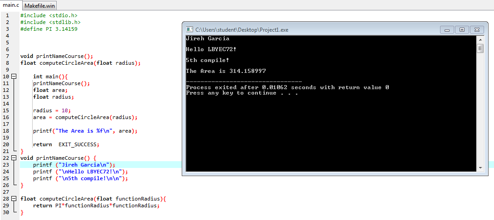

# LBYEC72-Practice
```
#include <stdio.h>
#include <stdlib.h>
#define PI 3.14159

void printNameCourse();
float computeCircleArea(float radius);

	int main(){
	printNameCourse();
	float area;
	float radius;
	
	radius = 10;
	area = computeCircleArea(radius);
	
	printf("The Area is %f\n", area);
	
	return 	EXIT_SUCCESS;
}
void printNameCourse() {
	printf ("Jireh Garcia\n");
	printf ("\nHello LBYEC72!\n");
	printf ("\n5th compile!\n\n");
}

float computeCircleArea(float functionRadius){
	return PI*functionRadius*functionRadius;
}

```

